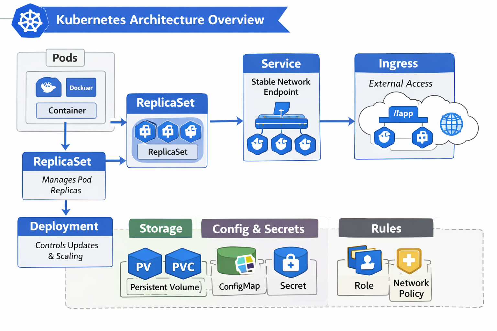

Here’s the visual diagram you asked for — it maps out how Kubernetes objects interact, from Pods all the way up to Ingress and supporting components like storage, configs, and policies:

This flowchart shows:
- **Pods → ReplicaSets → Deployments** for workload management.  
- **Services → Ingress** for networking and external access.  
- **Storage (PV/PVC), Config & Secrets, and Rules (Roles, NetworkPolicies)** as foundational layers.  

It’s a clean way to visualize the hierarchy and relationships.  

Would you like me to also create a **scenario-based example diagram** (e.g., a web app with frontend, backend, database, and how these Kubernetes objects tie together)? That would make it even more practical for your portfolio and outreach work.
