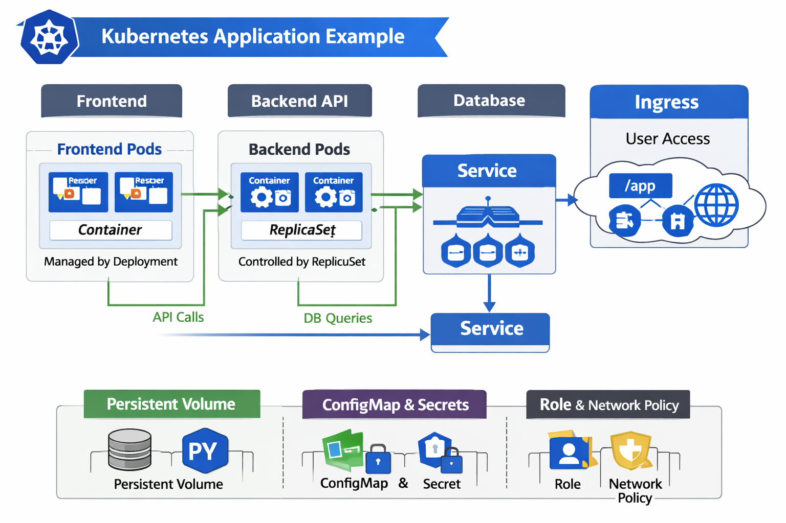

Here’s the **scenario-based Kubernetes architecture diagram** you requested — it visualizes a typical web application setup with frontend, backend, and database components managed through Kubernetes objects.  

You can view it here:  


### 🧩 Breakdown of the Architecture
- **Frontend Pods (Deployment)**: Serve the web UI, scaled and updated via a Deployment controller.  
- **Backend Pods (ReplicaSet)**: Handle API logic and business rules, ensuring consistent replicas.  
- **Database Pod (StatefulSet)**: Maintains persistent identity and storage for data consistency.  
- **Service & Ingress**: Provide internal routing and external access via stable endpoints and HTTP paths.  
- **Persistent Volume (PV/PVC)**: Stores data beyond Pod lifecycles.  
- **ConfigMap & Secret**: Inject configuration and sensitive credentials securely.  
- **Role & NetworkPolicy**: Enforce access control and communication rules.

This layout mirrors real-world production setups — modular, scalable, and secure.  

Would you like me to extend this into a **YAML manifest example** showing how these objects are defined and linked (e.g., Deployment + Service + Ingress + PVC)? It would make a great addition to your technical portfolio.

Perfect — let’s build a **complete YAML manifest** for the Kubernetes web app architecture we just visualized. This example includes a **frontend**, **backend**, and **database**, along with **Services**, **Ingress**, and **PersistentVolumeClaims**.  

Here’s a modular, production-style setup:

```yaml
# -------------------------------
# Namespace
# -------------------------------
apiVersion: v1
kind: Namespace
metadata:
  name: webapp-demo

# -------------------------------
# Frontend Deployment & Service
# -------------------------------
apiVersion: apps/v1
kind: Deployment
metadata:
  name: frontend-deployment
  namespace: webapp-demo
spec:
  replicas: 3
  selector:
    matchLabels:
      app: frontend
  template:
    metadata:
      labels:
        app: frontend
    spec:
      containers:
        - name: frontend
          image: nginx:latest
          ports:
            - containerPort: 80
          envFrom:
            - configMapRef:
                name: frontend-config
---
apiVersion: v1
kind: Service
metadata:
  name: frontend-service
  namespace: webapp-demo
spec:
  selector:
    app: frontend
  ports:
    - port: 80
      targetPort: 80
  type: ClusterIP

# -------------------------------
# Backend Deployment & Service
# -------------------------------
apiVersion: apps/v1
kind: Deployment
metadata:
  name: backend-deployment
  namespace: webapp-demo
spec:
  replicas: 2
  selector:
    matchLabels:
      app: backend
  template:
    metadata:
      labels:
        app: backend
    spec:
      containers:
        - name: backend
          image: prasenjit/backend-api:latest
          ports:
            - containerPort: 8080
          envFrom:
            - secretRef:
                name: backend-secrets
---
apiVersion: v1
kind: Service
metadata:
  name: backend-service
  namespace: webapp-demo
spec:
  selector:
    app: backend
  ports:
    - port: 8080
      targetPort: 8080
  type: ClusterIP

# -------------------------------
# Database StatefulSet & PVC
# -------------------------------
apiVersion: apps/v1
kind: StatefulSet
metadata:
  name: db-statefulset
  namespace: webapp-demo
spec:
  serviceName: db-service
  replicas: 1
  selector:
    matchLabels:
      app: database
  template:
    metadata:
      labels:
        app: database
    spec:
      containers:
        - name: postgres
          image: postgres:15
          ports:
            - containerPort: 5432
          env:
            - name: POSTGRES_DB
              value: webapp
            - name: POSTGRES_USER
              valueFrom:
                secretKeyRef:
                  name: backend-secrets
                  key: db-user
            - name: POSTGRES_PASSWORD
              valueFrom:
                secretKeyRef:
                  name: backend-secrets
                  key: db-password
          volumeMounts:
            - name: db-storage
              mountPath: /var/lib/postgresql/data
  volumeClaimTemplates:
    - metadata:
        name: db-storage
      spec:
        accessModes: ["ReadWriteOnce"]
        resources:
          requests:
            storage: 5Gi
---
apiVersion: v1
kind: Service
metadata:
  name: db-service
  namespace: webapp-demo
spec:
  selector:
    app: database
  ports:
    - port: 5432
      targetPort: 5432
  clusterIP: None

# -------------------------------
# Ingress
# -------------------------------
apiVersion: networking.k8s.io/v1
kind: Ingress
metadata:
  name: webapp-ingress
  namespace: webapp-demo
  annotations:
    nginx.ingress.kubernetes.io/rewrite-target: /
spec:
  rules:
    - host: webapp.local
      http:
        paths:
          - path: /
            pathType: Prefix
            backend:
              service:
                name: frontend-service
                port:
                  number: 80
          - path: /api
            pathType: Prefix
            backend:
              service:
                name: backend-service
                port:
                  number: 8080

# -------------------------------
# ConfigMap & Secret
# -------------------------------
apiVersion: v1
kind: ConfigMap
metadata:
  name: frontend-config
  namespace: webapp-demo
data:
  APP_THEME: "light"
  API_URL: "http://backend-service.webapp-demo.svc.cluster.local:8080"

---
apiVersion: v1
kind: Secret
metadata:
  name: backend-secrets
  namespace: webapp-demo
type: Opaque
stringData:
  db-user: "admin"
  db-password: "securepass123"
```

---

### 🧠 How This Works
- **Frontend** serves static content and connects to the backend via internal DNS.
- **Backend** exposes APIs and connects to the **PostgreSQL database**.
- **StatefulSet** ensures the database Pod retains identity and persistent storage.
- **Ingress** routes external traffic to frontend and backend paths.
- **ConfigMap** and **Secret** inject configuration and credentials securely.

Would you like me to extend this with **HorizontalPodAutoscaler (HPA)** and **NetworkPolicy** examples next? That would complete the production-grade setup.

Great — let’s extend your Kubernetes web app manifest with **HorizontalPodAutoscaler (HPA)** for scaling and **NetworkPolicy** for security. These additions make the setup closer to production-grade.

```yaml
# -------------------------------
# Horizontal Pod Autoscaler (Frontend)
# -------------------------------
apiVersion: autoscaling/v2
kind: HorizontalPodAutoscaler
metadata:
  name: frontend-hpa
  namespace: webapp-demo
spec:
  scaleTargetRef:
    apiVersion: apps/v1
    kind: Deployment
    name: frontend-deployment
  minReplicas: 2
  maxReplicas: 6
  metrics:
    - type: Resource
      resource:
        name: cpu
        target:
          type: Utilization
          averageUtilization: 70

# -------------------------------
# Horizontal Pod Autoscaler (Backend)
# -------------------------------
apiVersion: autoscaling/v2
kind: HorizontalPodAutoscaler
metadata:
  name: backend-hpa
  namespace: webapp-demo
spec:
  scaleTargetRef:
    apiVersion: apps/v1
    kind: Deployment
    name: backend-deployment
  minReplicas: 2
  maxReplicas: 5
  metrics:
    - type: Resource
      resource:
        name: memory
        target:
          type: Utilization
          averageUtilization: 75

# -------------------------------
# NetworkPolicy (Restrict DB Access)
# -------------------------------
apiVersion: networking.k8s.io/v1
kind: NetworkPolicy
metadata:
  name: db-access-policy
  namespace: webapp-demo
spec:
  podSelector:
    matchLabels:
      app: database
  policyTypes:
    - Ingress
  ingress:
    - from:
        - podSelector:
            matchLabels:
              app: backend
      ports:
        - protocol: TCP
          port: 5432

# -------------------------------
# NetworkPolicy (Frontend Isolation)
# -------------------------------
apiVersion: networking.k8s.io/v1
kind: NetworkPolicy
metadata:
  name: frontend-policy
  namespace: webapp-demo
spec:
  podSelector:
    matchLabels:
      app: frontend
  policyTypes:
    - Ingress
    - Egress
  ingress:
    - from:
        - namespaceSelector:
            matchLabels:
              kubernetes.io/metadata.name: webapp-demo
      ports:
        - protocol: TCP
          port: 80
  egress:
    - to:
        - podSelector:
            matchLabels:
              app: backend
      ports:
        - protocol: TCP
          port: 8080
```

---

### 🔍 What These Additions Do
- **HPA (Frontend & Backend)**: Automatically scales Pods based on CPU or memory usage thresholds.
- **NetworkPolicy (DB Access)**: Ensures only backend Pods can talk to the database on port 5432.
- **NetworkPolicy (Frontend Isolation)**: Restricts frontend Pods to only communicate with backend Pods, blocking unnecessary external traffic.

This combination gives you **scalability + security** — two pillars of a production-ready Kubernetes deployment.

Would you like me to also add a **PodDisruptionBudget (PDB)** so that your app maintains availability during node upgrades or voluntary disruptions? That would complete the resilience layer.

Excellent — let’s add the **PodDisruptionBudget (PDB)** layer to ensure high availability during voluntary disruptions like node upgrades or maintenance. This guarantees that a minimum number of Pods remain running even when the cluster is under change.

Here’s how it fits into your web app manifest:

```yaml
# -------------------------------
# PodDisruptionBudget for Frontend
# -------------------------------
apiVersion: policy/v1
kind: PodDisruptionBudget
metadata:
  name: frontend-pdb
  namespace: webapp-demo
spec:
  minAvailable: 2
  selector:
    matchLabels:
      app: frontend

# -------------------------------
# PodDisruptionBudget for Backend
# -------------------------------
apiVersion: policy/v1
kind: PodDisruptionBudget
metadata:
  name: backend-pdb
  namespace: webapp-demo
spec:
  minAvailable: 1
  selector:
    matchLabels:
      app: backend

# -------------------------------
# PodDisruptionBudget for Database
# -------------------------------
apiVersion: policy/v1
kind: PodDisruptionBudget
metadata:
  name: db-pdb
  namespace: webapp-demo
spec:
  maxUnavailable: 0
  selector:
    matchLabels:
      app: database
```

---

### 🔍 What These Do
- **Frontend PDB**: Ensures at least 2 frontend Pods remain available during disruptions, keeping the UI responsive.  
- **Backend PDB**: Guarantees at least 1 backend Pod stays up, so API calls don’t fail completely.  
- **Database PDB**: Prevents the database Pod from being disrupted at all (`maxUnavailable: 0`), protecting critical stateful data.  

With **Deployments + StatefulSets + Services + Ingress + HPA + NetworkPolicies + PDBs**, you now have a **resilient, scalable, and secure Kubernetes architecture** — a strong showcase for your portfolio.

Would you like me to also prepare a **step-by-step deployment guide** (kubectl commands + order of applying manifests) so you can demonstrate this setup live in interviews or outreach sessions?

Here’s a **step-by-step deployment guide** you can use to apply the full Kubernetes web app architecture we’ve built together. This sequence ensures smooth rollout and avoids dependency issues:

---

## 🛠 Step 1: Create Namespace
```bash
kubectl apply -f namespace.yaml
```
This isolates your app into its own logical space (`webapp-demo`).

---

## 🛠 Step 2: Apply Configurations & Secrets
```bash
kubectl apply -f configmap.yaml
kubectl apply -f secret.yaml
```
These must be applied before workloads so Pods can reference them.

---

## 🛠 Step 3: Deploy Workloads
```bash
kubectl apply -f frontend-deployment.yaml
kubectl apply -f backend-deployment.yaml
kubectl apply -f db-statefulset.yaml
```
This spins up your **frontend**, **backend**, and **database** Pods.

---

## 🛠 Step 4: Expose Services
```bash
kubectl apply -f frontend-service.yaml
kubectl apply -f backend-service.yaml
kubectl apply -f db-service.yaml
```
Services provide stable networking endpoints inside the cluster.

---

## 🛠 Step 5: Configure Ingress
```bash
kubectl apply -f ingress.yaml
```
This exposes your app externally at `http://webapp.local/` and `http://webapp.local/api`.

---

## 🛠 Step 6: Add Scaling & Security
```bash
kubectl apply -f frontend-hpa.yaml
kubectl apply -f backend-hpa.yaml
kubectl apply -f db-access-policy.yaml
kubectl apply -f frontend-policy.yaml
```
This enables **autoscaling** and enforces **network isolation**.

---

## 🛠 Step 7: Add Resilience
```bash
kubectl apply -f frontend-pdb.yaml
kubectl apply -f backend-pdb.yaml
kubectl apply -f db-pdb.yaml
```
PodDisruptionBudgets ensure minimum availability during upgrades.

---

## 🛠 Step 8: Verify Deployment
```bash
kubectl get pods -n webapp-demo
kubectl get svc -n webapp-demo
kubectl get ingress -n webapp-demo
kubectl describe hpa frontend-hpa -n webapp-demo
kubectl describe pdb frontend-pdb -n webapp-demo
```
Check Pods, Services, Ingress routing, autoscaling, and disruption budgets.

---

### ✅ Deployment Flow Recap
1. Namespace → Configs/Secrets → Workloads  
2. Services → Ingress → HPA/NetworkPolicy → PDB  
3. Verify everything with `kubectl get` and `kubectl describe`

---

This guide gives you a **live demo-ready workflow**: you can showcase how Kubernetes objects interact, scale, and secure workloads in real time.  

Would you like me to also prepare a **troubleshooting runbook** (common errors + fixes, e.g., CrashLoopBackOff, Ingress not resolving, PVC pending)? That would make your portfolio even stronger for interviews.

Here’s a **Kubernetes troubleshooting runbook** tailored for the architecture we built. It covers the most common issues you’ll face in demos, interviews, or production, with quick fixes and diagnostic commands.

---

## 🚨 Common Issues & Fixes

### 1. **Pods in CrashLoopBackOff**
- **Symptoms**: Pods keep restarting, status shows `CrashLoopBackOff`.
- **Diagnostics**:
  ```bash
  kubectl describe pod <pod-name> -n webapp-demo
  kubectl logs <pod-name> -n webapp-demo
  ```
- **Fixes**:
  - Check environment variables (ConfigMap/Secret references).
  - Verify container image exists and is accessible.
  - Ensure database credentials match (`db-user`, `db-password`).

---

### 2. **PVC Pending**
- **Symptoms**: Database Pod stuck, PVC shows `Pending`.
- **Diagnostics**:
  ```bash
  kubectl get pvc -n webapp-demo
  kubectl describe pvc db-storage -n webapp-demo
  ```
- **Fixes**:
  - Ensure a **StorageClass** exists in the cluster.
  - If none, create a default StorageClass or manually bind to a PV.

---

### 3. **Ingress Not Resolving**
- **Symptoms**: App not accessible at `http://webapp.local`.
- **Diagnostics**:
  ```bash
  kubectl get ingress -n webapp-demo
  kubectl describe ingress webapp-ingress -n webapp-demo
  ```
- **Fixes**:
  - Verify Ingress controller (e.g., NGINX) is installed.
  - Add DNS entry or `/etc/hosts` mapping for `webapp.local`.
  - Check annotations for rewrite rules.

---

### 4. **HPA Not Scaling**
- **Symptoms**: Pods don’t scale despite load.
- **Diagnostics**:
  ```bash
  kubectl describe hpa frontend-hpa -n webapp-demo
  kubectl top pods -n webapp-demo
  ```
- **Fixes**:
  - Ensure metrics-server is installed and running.
  - Verify resource requests/limits are set in Deployment specs.

---

### 5. **NetworkPolicy Blocking Traffic**
- **Symptoms**: Frontend can’t reach backend, or backend can’t reach DB.
- **Diagnostics**:
  ```bash
  kubectl describe networkpolicy -n webapp-demo
  ```
- **Fixes**:
  - Confirm Pod labels match NetworkPolicy selectors.
  - Adjust ingress/egress rules to allow required traffic.

---

### 6. **PodDisruptionBudget Preventing Upgrades**
- **Symptoms**: Node drain fails, message: “cannot evict Pod due to PDB.”
- **Diagnostics**:
  ```bash
  kubectl describe pdb -n webapp-demo
  ```
- **Fixes**:
  - Temporarily adjust `minAvailable` or `maxUnavailable`.
  - Scale up replicas before draining nodes.

---

## 🧩 Quick Recovery Checklist
1. **Check Pod logs** → `kubectl logs`
2. **Describe resources** → `kubectl describe`
3. **Check events** → `kubectl get events -n webapp-demo`
4. **Verify DNS & Services** → `kubectl get svc`
5. **Validate Ingress routing** → `kubectl get ingress`

---

This runbook gives you a **ready-to-use troubleshooting guide** for interviews and real-world demos.  

Would you like me to also prepare a **visual troubleshooting flowchart** (e.g., “Pod failing → check logs → fix ConfigMap/Secret → redeploy”) so you can present it as part of your portfolio?
